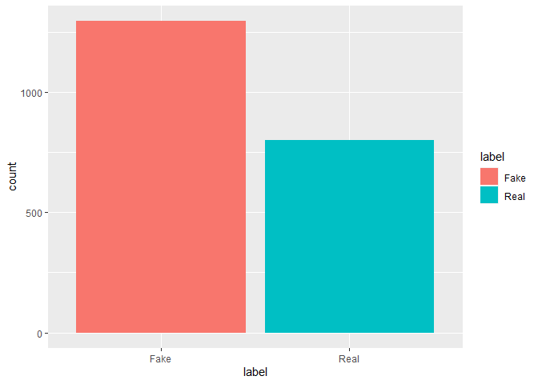
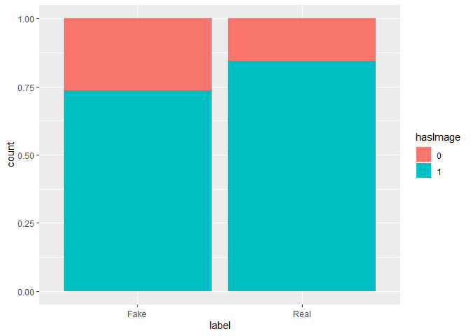
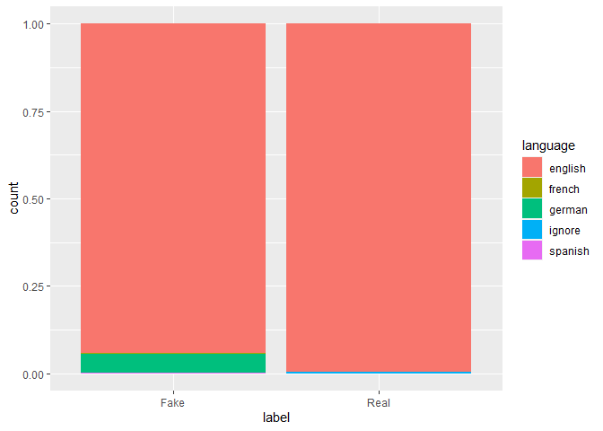
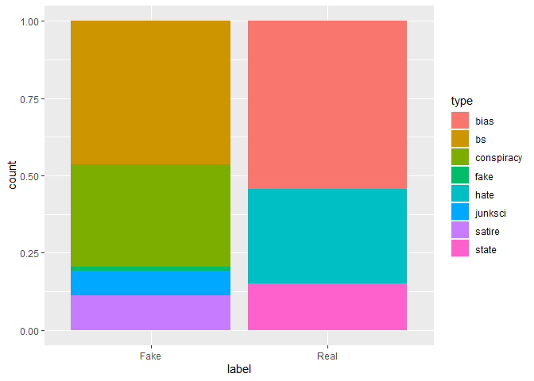
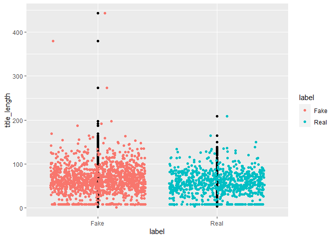
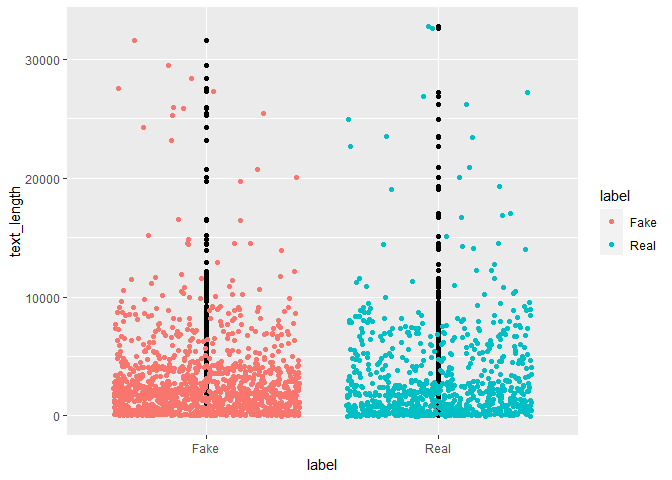
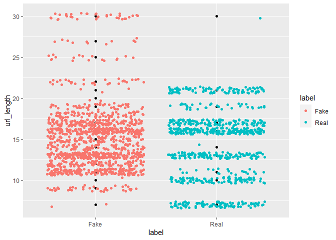

Every day hundreds of sources such as social media, news channels, politicians or civilians spread fake news. Deciding which one is real or fake sometimes could be hard. Content could be tricky and unfortunately we find it highly believable. Nevertheless there are lots of metrics that we can catch fake news. The aim of this study is deciding whether the news are fake or not with machine learning algorithms.

First, we start with recognize the data more close and make some cleaning and adjustment in EDA part. After that we apply appropriate ML methods to predict fake news.


When we glimpse the data we can observe that some variables types are wrong. We need to convert that variables from character to factor in order to analyze correctly.


```r
news$language <- as.factor(news$language)
news$label <- as.factor(news$label)
news$hasImage <- as.factor(news$hasImage)
news$type <- as.factor(news$type)
```

Now we should observe NA values and we removed from dataset if it is necessary.


```r
which(is.na(news))
```

```
## [1] 25152
```

```r
news <- news %>%
  drop_na()
```


```r
table(news$label)
```

```
## 
##      Fake Real 
##    0 1294  801
```

```r
table(news$hasImage)
```

```
## 
##    0    1 
##  467 1628
```

```r
table(news$language)
```

```
## 
##         english  french  german  ignore spanish 
##       0    2017       2      72       3       1
```

```r
table(news$type)
```

```
## 
##                  bias         bs conspiracy       fake       hate    junksci 
##          0        436        601        430         15        244        102 
##     satire      state 
##        146        121
```
According to the table above, there are 1294 fake news and 801 real news and also we can see how many news in each language, type and how much news has image or not. Let's look at how these variables affect whether the news are fake or not with data visualization.


```r
par(mfrow=c(2,2))
ggplot(news, aes(label,fill = label)) + 
  geom_bar()
```

<!-- -->

```r
ggplot(news, aes(label, fill = hasImage)) + 
  geom_bar(position = "fill")
```

<!-- -->

```r
ggplot(news, aes(label, fill = language)) + 
  geom_bar(position = "fill")
```

<!-- -->

```r
ggplot(news, aes(label, fill = type)) + 
  geom_bar(position = "fill")
```

<!-- -->
According to the plots above. We can say that news without images are tend to be fake and types of the fake news are satire, junk science, fake, conspiracy and bullshit; types of the real news are state, hate and bias. We cannot say about language and fake news relation as there are very few observations in different language categories.


```r
news_length <- news %>%
  mutate(text_length = nchar(text),
         title_length = nchar(title),
         url_length = nchar(site_url))

ggplot(news_length, aes(label,title_length)) + 
  geom_point() + 
  geom_jitter(aes(colour = label))
```

<!-- -->

```r
ggplot(news_length, aes(label,text_length)) + 
  geom_point() + 
  geom_jitter(aes(colour = label))
```

<!-- -->

```r
ggplot(news_length, aes(label,url_length)) + 
  geom_point() + 
  geom_jitter(aes(colour = label))
```

<!-- -->
Now we examine the effect of text, title and url lengths how effect whether news are fake or not. According to the plots above, fake news tend to have longer title and url than real news but we cannot say the same thing about title length precisely. 


```r
summary_table <- news_length %>%
  group_by(label) %>%
  summarize(text_mean = mean(text_length),
            title_mean = mean(title_length),
            url_mean = mean(url_length))
summary_table
```

```
## # A tibble: 2 x 4
##   label text_mean title_mean url_mean
##   <fct>     <dbl>      <dbl>    <dbl>
## 1 Fake      2828.       64.7     15.2
## 2 Real      3027.       55.9     14.5
```
Lastly if we observe length mean for all three subject we can get more precise results. Acorrding to the table we can say that fake news have shorter text length, longer title length and url length than real news.


```r
corpus <- Corpus(VectorSource(news$text_without_stopwords))
dev.new(width = 1500, height = 1500, unit = "px")

wordcloud(corpus, max.words=200, random.order=FALSE, scale=c(3,.4), rot.per=0.15, colors=brewer.pal(12,"Paired"))
```

This wordcloud shows that most frequency words from all words in news text. 

# Machine Learning Models

## 1. Naive Bayes

It is a classification method that rely on bayesian approach. It According to naive bayes all the features in the dataset should be independent and equally important. For this reason in most of the case this method couldn't be appropiate because of it couldn't fulfill the assumptions. On the other hand in some cases such as text classification like spam mail detection or in our case (fake news detection) naive bayes fulfill both conditions and get highly well accuracy. It is easy to apply and effective model. Also it could handle with NA's and big messy data.

Let's apply naive method to news dataset. First we have to clean and standardize text data with text mining package which name is "tm".


```r
## text
corpus_text <- VCorpus(VectorSource((news$text)))
inspect(corpus_text[1:2])
```

```
## <<VCorpus>>
## Metadata:  corpus specific: 0, document level (indexed): 0
## Content:  documents: 2
## 
## [[1]]
## <<PlainTextDocument>>
## Metadata:  7
## Content:  chars: 492
## 
## [[2]]
## <<PlainTextDocument>>
## Metadata:  7
## Content:  chars: 1720
```

```r
##title
corpus_title <- VCorpus(VectorSource((news$title)))
inspect(corpus_title[1:2])
```

```
## <<VCorpus>>
## Metadata:  corpus specific: 0, document level (indexed): 0
## Content:  documents: 2
## 
## [[1]]
## <<PlainTextDocument>>
## Metadata:  7
## Content:  chars: 51
## 
## [[2]]
## <<PlainTextDocument>>
## Metadata:  7
## Content:  chars: 57
```

```r
abc <- news %>%
  select(text,label)
abc <- abc[1:2050,]
names(abc) <- c("x","y")

abcd <- news %>%
  select(title,label)
abcd <- abcd[1:2050,]
names(abcd) <- c("x","y")

f <- rbind(abc,abcd)
corpus_f <- VCorpus(VectorSource((f$x)))
inspect(corpus_title[1:2])
```

```
## <<VCorpus>>
## Metadata:  corpus specific: 0, document level (indexed): 0
## Content:  documents: 2
## 
## [[1]]
## <<PlainTextDocument>>
## Metadata:  7
## Content:  chars: 51
## 
## [[2]]
## <<PlainTextDocument>>
## Metadata:  7
## Content:  chars: 57
```
Corpus enable to collect text data as a "corpus". We can observe corpus how to stored our text data in code chunk above. We can see that there are punctuations and stopwords in text. Firstly we should clean these before set a model.


```r
## text
corpus_text_clean <- tm_map(corpus_text, content_transformer(tolower))
corpus_text_clean <- tm_map(corpus_text_clean, removeWords, stopwords())
corpus_text_clean <- tm_map(corpus_text_clean, removePunctuation)
corpus_text_clean <- tm_map(corpus_text_clean, stemDocument)
corpus_text_clean <- tm_map(corpus_text_clean, stripWhitespace)


## title
corpus_title_clean <- tm_map(corpus_title, content_transformer(tolower))
corpus_title_clean <- tm_map(corpus_title_clean, removeWords, stopwords())
corpus_title_clean <- tm_map(corpus_title_clean, removePunctuation)
corpus_title_clean <- tm_map(corpus_title_clean, stemDocument)
corpus_title_clean <- tm_map(corpus_title_clean, stripWhitespace)

corpus_title_f <- tm_map(corpus_f, content_transformer(tolower))
corpus_title_f <- tm_map(corpus_title_f, removeWords, stopwords())
corpus_title_f <- tm_map(corpus_title_f, removePunctuation)
corpus_title_f <- tm_map(corpus_title_f, stemDocument)
corpus_title_f <- tm_map(corpus_title_f, stripWhitespace)
```

Now corpus looks clean enough to analyze. Next step is Creating a Document Term Matrix that allows to create data structure with corpus. With this way we can split text documents into words.


```r
## text
news_dtm <- DocumentTermMatrix(corpus_text_clean, control = list(
  tolower = TRUE,
  removeNumbers = TRUE,
  stopwords = TRUE,
  removePunctuation = TRUE,
  stemming = TRUE))
set.seed(1000)
news_dtm <- removeSparseTerms(news_dtm, 0.9)
news_dtm
```

```
## <<DocumentTermMatrix (documents: 2095, terms: 286)>>
## Non-/sparse entries: 100210/498960
## Sparsity           : 83%
## Maximal term length: 10
## Weighting          : term frequency (tf)
```

```r
## title
news_dtm_title <- DocumentTermMatrix(corpus_title_clean, control = list(
  tolower = TRUE,
  removeNumbers = TRUE,
  stopwords = TRUE,
  removePunctuation = TRUE,
  stemming = TRUE))
set.seed(1000)
news_dtm_title <- removeSparseTerms(news_dtm_title, 0.9)
news_dtm_title
```

```
## <<DocumentTermMatrix (documents: 2095, terms: 3)>>
## Non-/sparse entries: 766/5519
## Sparsity           : 88%
## Maximal term length: 7
## Weighting          : term frequency (tf)
```

```r
###
news_dtm_f <- DocumentTermMatrix(corpus_title_f, control = list(
  tolower = TRUE,
  removeNumbers = TRUE,
  stopwords = TRUE,
  removePunctuation = TRUE,
  stemming = TRUE))
set.seed(1000)
news_dtm_f <- removeSparseTerms(news_dtm_f, 0.9)
news_dtm_f
```

```
## <<DocumentTermMatrix (documents: 4100, terms: 74)>>
## Non-/sparse entries: 43444/259956
## Sparsity           : 86%
## Maximal term length: 8
## Weighting          : term frequency (tf)
```

The last step before analysis is to convert the corpus to an trainable format.The last step before analysis is to convert the corpus to an trainable format. That's why we're converting corpus to matrix format. In addition, since we make the analysis in 3 different groups according to text, title and both title and text classes, we create 3 different matrices.


```r
## text
text_full <- as.matrix(news_dtm)
text_label <- as.matrix(news$label)

## title
title_full <- as.matrix(news_dtm_title)
title_label <- as.matrix(news$label)

## full
f_f <- as.matrix(news_dtm_f)
f_l <- as.matrix(f$y)
```

In the current step, we have created our train and test data. Train data contains 70% of data randomly selected from all data. and the rest is the test data. After that, we can apply the naive bayes algorithm.


```r
training_index <- sample(1:nrow(news), round(nrow(news) * .75))
training_index2 <- sample(1:nrow(f), round(nrow(f) * .75))

## text
set.seed(1000)

text_train <- text_full[training_index,]
text_test <- text_full[-training_index,]
naive_text <- naiveBayes(text_train, as.factor(text_label[training_index]))
pred_text <- predict(naive_text, text_test)
table(pred_text, text_label[-training_index])
```

```
##          
## pred_text Fake Real
##      Fake  245  162
##      Real   74   43
```

```r
## title
set.seed(1000)

title_train <- title_full[training_index,]
title_test <- title_full[-training_index,]
naive_title <- naiveBayes(title_train, as.factor(title_label[training_index]))
pred_title <- predict(naive_title, title_test)
table(pred_title, title_label[-training_index])
```

```
##           
## pred_title Fake Real
##       Fake  288  155
##       Real   31   50
```

```r
## full
f_train <- f_f[training_index2,]
f_test <- f_f[-training_index2,]
naive_f <- naiveBayes(f_train, as.factor(f_l[training_index2]))
pred_f <- predict(naive_f, f_test)
table(pred_f, f_l[-training_index2])
```

```
##       
## pred_f Fake Real
##   Fake  564  321
##   Real   71   69
```


```r
a <- sum(text_label[-training_index] == pred_text)/ length(pred_text)
b <- sum(title_label[-training_index] == pred_title)/ length(pred_title)
c <- sum(f_l[-training_index2] == pred_f)/ length(pred_f)


print(c(a,b,c))
```

```
## [1] 0.5496183 0.6450382 0.6175610
```
In the 3 naive bayes model applied, it has been the most successful model with titles. According to this model, 288 of the fake news were guessed correctly and 155 were wrong, 50 of the real news were correct and 31 of them were wrong. The accuracy rate of this model made with titles is 64%.

## 2. Logistic Regression

Logistic regression is the correct type of analysis to use when we’re working with binary data. We know we’re dealing with binary data when the output or dependent variable is dichotomous or categorical in nature; in other words, if it fits into one of two categories (such as “yes” or “no”, “pass” or “fail”, and so on). So this algorithm quite well to apply our data. We will use same train and test data to predict with logistic regression.


```r
glm_title <- glmnet(x=title_train , y=title_label[training_index], family = "binomial")
predicted_glm <- predict(glm_title, title_test, type = "class")

accuracy_glm <- sum(title_label[-training_index] == predicted_glm)/ length(predicted_glm)


#####
glm_text <- glmnet(x=text_train , y=text_label[training_index], family = "binomial")
predicted_glm_text <- predict(glm_text, text_test, type = "class")

accuracy_glm_text <- sum(text_label[-training_index] == predicted_glm_text)/ length(predicted_glm_text)


####
glm_full <- glmnet(x = f_train, y = f_l[training_index2], family = "binomial")
predicted_glm_full <- predict(glm_full, f_test, type = "class")
accuracy_glm_full <- sum(f_l[-training_index2] == predicted_glm_full)/ length(predicted_glm_full)


print(c(accuracy_glm,accuracy_glm_text,accuracy_glm_full))
```

```
## [1] 0.6257634 0.5970829 0.6146134
```
Models made with the title in the predicts made by the Logistic regression was the best model with 62% accuracy. But it could not create a better model than naive bayes.

## 3. Random Forest

Random Forest is a classifier that contains a number of decision trees on various subsets of the given dataset and takes the average to improve the predictive accuracy of that dataset. 

* It takes less training time as compared to other algorithms.
* It predicts output with high accuracy, even for the large dataset it runs efficiently.
* It can also maintain accuracy when a large proportion of data is missing.

Let's apply random forest to our news data.


```r
set.seed(1000)
rf <- randomForest(x=title_train, y=as.factor(title_label[training_index]))
predicted_rf <- predict(rf, newdata = title_test)
accuracy_rf <- sum(title_label[-training_index] == predicted_rf)/ length(predicted_rf)
table(predicted_rf, text_label[-training_index])
```

```
##             
## predicted_rf Fake Real
##         Fake  299  164
##         Real   20   41
```

```r
set.seed(1000)
rf1 <- randomForest(x=text_train, y=as.factor(text_label[training_index]))
predicted_rf1 <- predict(rf1, newdata = text_test)
accuracy_rf1 <- sum(text_label[-training_index] == predicted_rf1)/ length(predicted_rf1)
table(predicted_rf1, title_label[-training_index])
```

```
##              
## predicted_rf1 Fake Real
##          Fake  277  123
##          Real   42   82
```

```r
set.seed(1000)
rf2 <- randomForest(f_train, as.factor(f_l[training_index2]))
predicted_rf2 <- predict(rf2, newdata = f_test)
accuracy_rf2 <- sum(f_l[-training_index2] == predicted_rf2)/ length(predicted_rf2)
table(predicted_rf2, f_l[-training_index2])
```

```
##              
## predicted_rf2 Fake Real
##          Fake  576  297
##          Real   59   93
```

```r
print(c(accuracy_rf,accuracy_rf1,accuracy_rf2))
```

```
## [1] 0.6488550 0.6851145 0.6526829
```
In the model made with Random Forest, the prediction model made with texts became the best model with 68% accuracy. Among the 3 tested algorithms, the most successful algorithm was random forest.

## References

Brett Lantz - Machine Learning with R
https://www.javatpoint.com/machine-learning-random-forest-algorithm
https://careerfoundry.com/en/blog/data-analytics/what-is-logistic-regression
https://www.kaggle.com/ruchi798/source-based-news-classification

